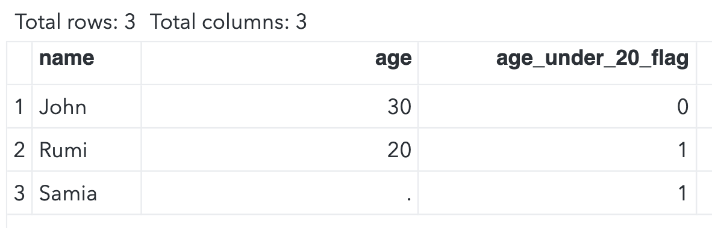

```{r setup, include=FALSE}
knitr::opts_chunk$set(echo = FALSE)
library(distill)
library(tidyverse)
# rename_post_dir("_posts/2021-06-19-how-na-affects-your-analysis")
```

If you are a statistician or work with researchers, chances are you often use both R and SAS depending on the project's need. 

It happened with me once when I was switching from R to SAS to quickly create a report for a stakeholder. R being my primary tool for most of data science work, I got carried away and made some silly errors when I presented the data summary. The issue I fould later was due to how SAS handles missing values differently than R. 
R's handling of NA or missing value is quite intuitive that it will ignore the values with NA silently in most functions. So unless you care about counting the missing cases for reporting purposes, R silently excludes missing.

> However, SAS treats missing values as the smallest value in the colum, and does not ignore it. 

This is crucial. I will demonstrate how crucial it is and how it will affect your analysis.

## R and SAS handle missing values differently

Will be best if I show you an example. 

Let's create a fake data set. 

```{r, echo=TRUE}
df = data.frame(name= c("John", "Rumi", "Samia"),
                age = c(30, 20, NA))
df
```

Let's create a new variable based on condition unavailable that has a missing value.

```{r, echo=TRUE}
df %>% 
  mutate(
    age_under_20_flag = case_when(
      age <= 20 ~ 1,
      TRUE ~ 0
    ),
    
    age_under_20_flag_ifelse = if_else(age <= 20, 1, 0)
  )
```

Let's see how it does and SAS.

```
/* test data set to demonstrate how SAS handles missing values */

data df;
input name $ age;
cards;
John 30
Rumi 20
Samia .
;
run;

```

Now lets create the same flag if age equal or below 20

```{}
data df2;
  set df;
  if age <= 20 then age_under_20_flag = 1;
  else age_under_20_flag = 0;
run;

```

Now notice how SAS handled the missing value. SAS considers missing value as the smallest value in your column. Thus you really have to handle missing value separately, in this case, prior to applying the if



## How R handles NA

## How SAS handles NA


```{r, fig.align='center', out.width='120%'}
# knitr::include_graphics(here::here("sas_na_handling.png"))
```


